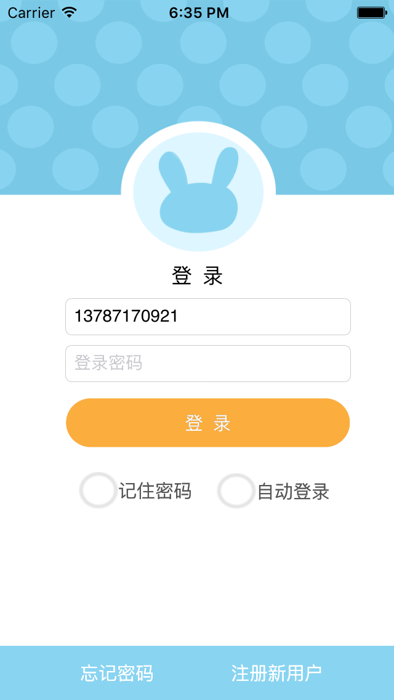
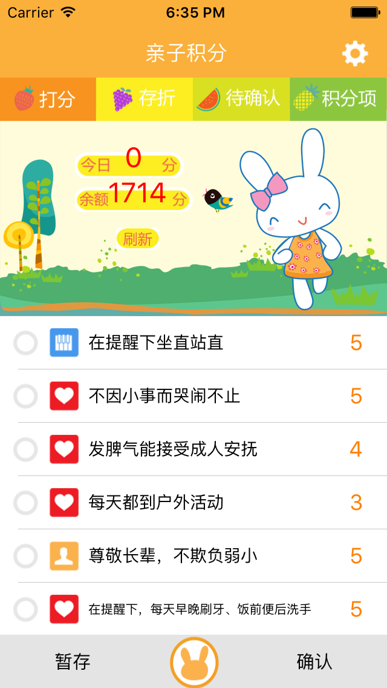
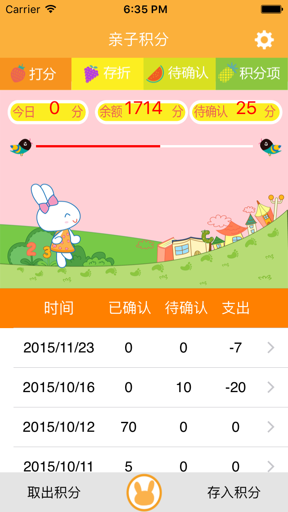
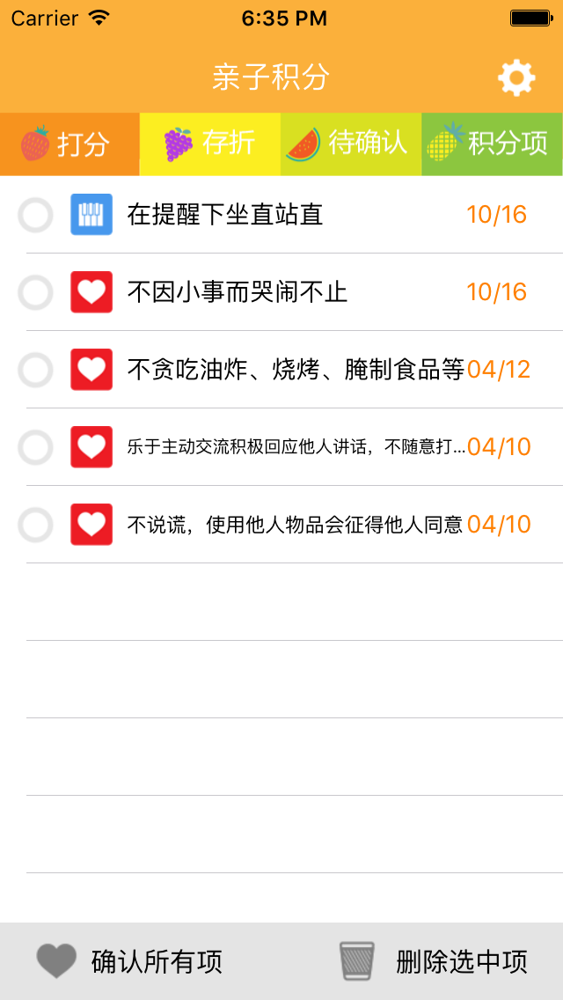
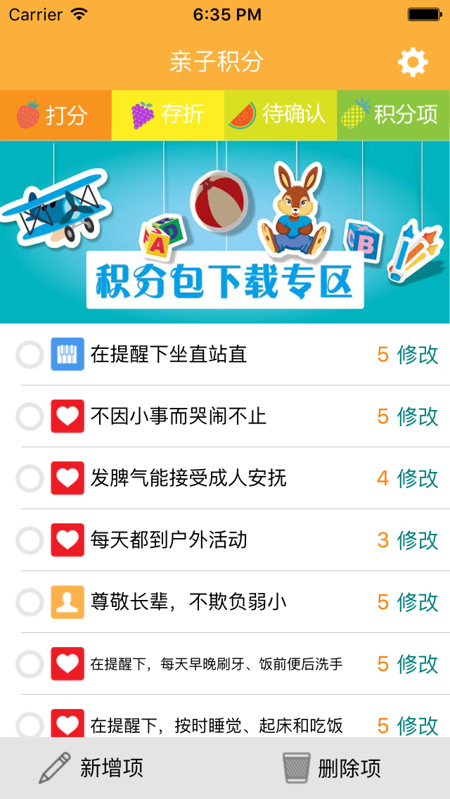
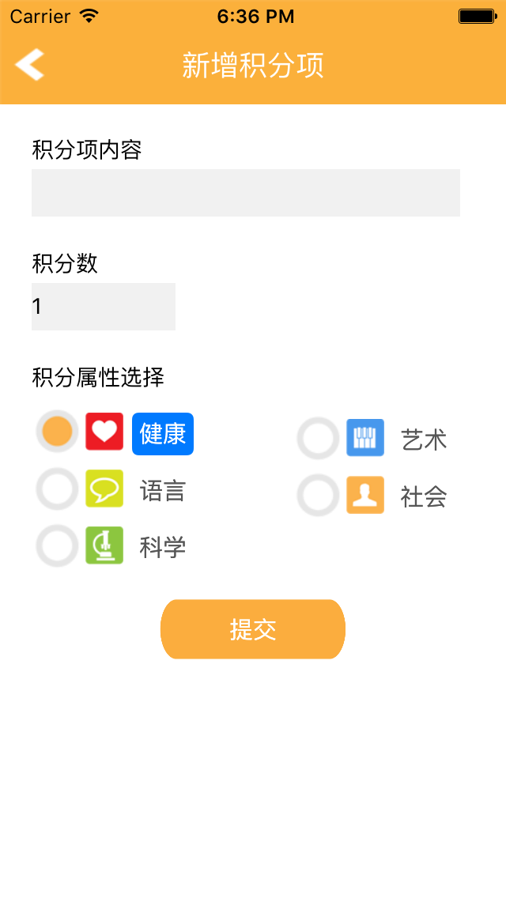
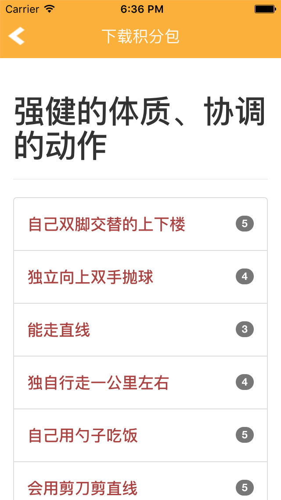
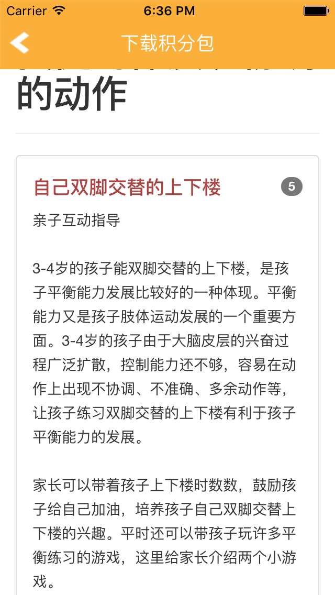
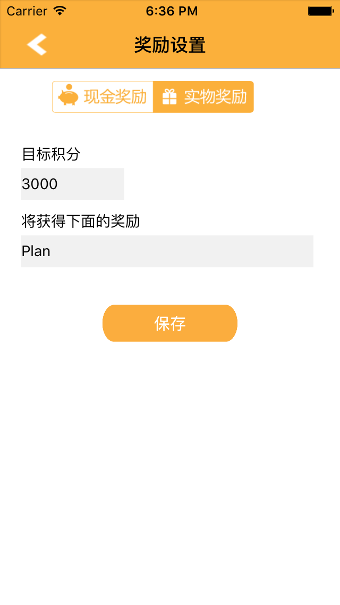

# 亲子成长积分

亲子成长积分，Android+IOS app，家长或者老师通过专家为各年龄段定制的积分体系，给孩子们每天的行为打分并给予奖励，达到培养孩子良好行为习惯的目的。

## 主要功能

-   教育专家为各年龄段定制的积分体系
-   积分可自定义
-   打分可以暂存（由家长确认）
-   积分存折功能（可存可取）
-   可以与孩子商定积分奖励
-   积分分健康、艺术、语文、社会、科学五个维度
-   界面美观、和孩子在轻松愉快的氛围中就培养了良好的行为习惯

## 系统截图

|  启动页面|  登录页面|  注册新用户 |
|:---------------------------:|:---------------------------:|:---------------------------:|
|  打分界面|  存折页面|  确认页面 |
|  积分定义页|  新建积分项|  搜索积分包 |
|  下载积分包|  下载积分包|  积分奖励 |
